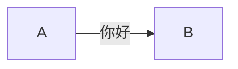

# 数学


\(f(a,b,c) = (a^2+b^2+c^2)^3\)

$$
\int_a^bf(x)dx
$$

% KaTeX block notation
$$
\varphi = 1+\frac{1} {1+\frac{1} {1+\frac{1} {1+\cdots} } }
$$

\(\varphi = \dfrac{1+\sqrt5}{2}= 1.6180339887…\)

\[\varphi = 1+\frac{1} {1+\frac{1} {1+\frac{1} {1+\cdots} } }\]

# 图片

# 图标简码









# 测试Mermaid


graph LR;
A[Lemons]-->|你好|B[Lemonade];
B-->C[Profit]


# 测试Callout


**警告！**此操作具有破坏性！



This is an error!


# 链接



# 图库

{{< carousel images="{https://cdn.pixabay.com/photo/2016/12/11/12/02/mountains-1899264_960_720.jpg, gallery/03.jpg, gallery/01.jpg, gallery/02.jpg, gallery/04.jpg}" >}}

# 图表


type: 'bar',
data: {
  labels: ['Tomato', 'Blueberry', 'Banana', 'Lime', 'Orange'],
  datasets: [{
    label: '# of votes',
    data: [12, 19, 3, 5, 3],
  }]
}









Lorem ipsum dolor sit amet, consectetur adipiscing elit. Vivamus non magna ex. Donec sollicitudin ut lorem quis lobortis. Nam ac ipsum libero. Sed a ex eget ipsum tincidunt venenatis quis sed nisl. Pellentesque sed urna vel odio consequat tincidunt id ut purus. Nam sollicitudin est sed dui interdum rhoncus. 



With html code
<ul>
  <li>Coffee</li>
  <li>Tea</li>
  <li>Milk</li>
</ul>








# 打字效果


你好,世界!我是贺昌嘉. 



Lorem ipsum dolor sit amet, 
consectetur adipiscing elit. 


# 嵌入视频


