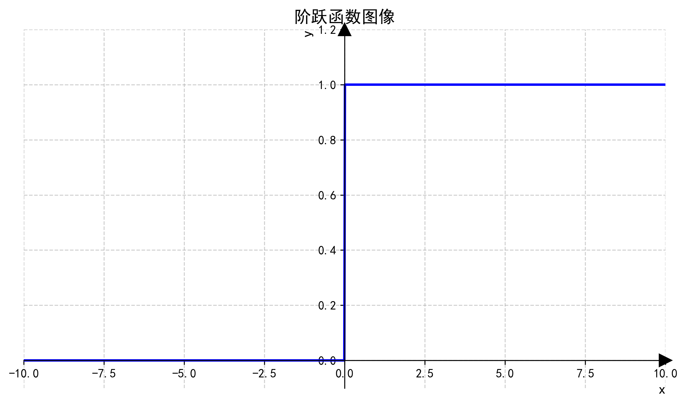
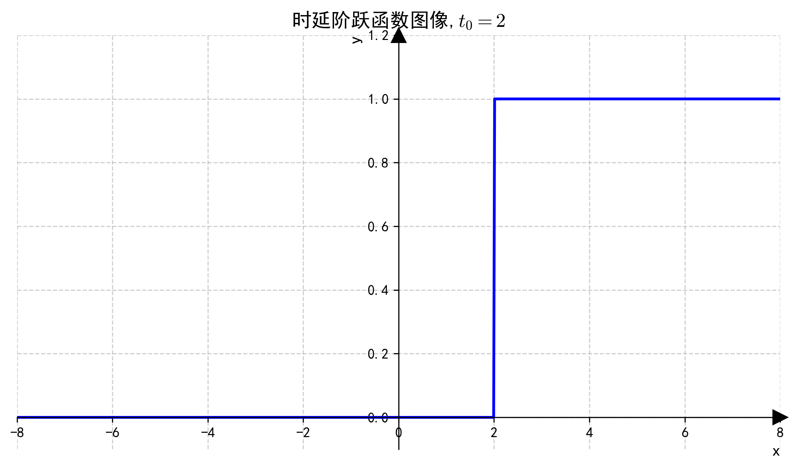
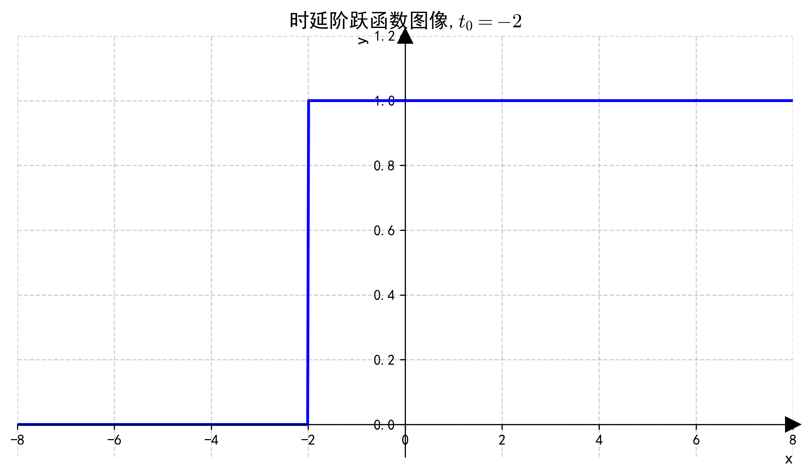

---

title: 信号与系统第二章
author: 贺昌嘉
tags: 
  - 总结
  - 笔记
created date: 2025年5月20日09:25:37

---


```markmap
---
markmap:
  zoom: false
  pan: false
  height: 300px
  backgroundColor: "#f8f8f8"
---

# 连续时间信号与系统的时域分析
# 典型的连续时间信号
## 复指数信号
### 直流信号
### 实指数信号
### 正弦信号
## 单位阶跃信号
## 单位冲激信号
### 冲激函数的定义
### 冲激函数的性质
# 连续时间信号的基本运算
# 信号的时域分解
# 连续时间信号的零输入响应
# 冲激响应
```

# <span style="color:#FF1CAE;">连续时间</span>信号与系统的<span style="color:#FF1CAE;">时域分析</span>

```kanban
Briefly Abstract
# Briefly Abstract
## 重点
- 重点1(将任意信号f(t)分解为<font color=#FF1CAE>冲激信号的线性组合</font>)
- 重点2(用<font color=#FF1CAE>卷积分析法</font>求解线性时不变系统中的<font color=#FF1CAE>零状态响应</font>.)

## 连续时间信号
- 分类 (复指数信号 \n <span style="color:#FF1CAE;">单位阶跃信号</span> \n <span style="color:#FF1CAE;">单位冲激信号</span> )
- 基本运算(<span style="color:#FF1CAE;">翻转,尺度变换,平移</span> \n 导数与积分 \n 相加与相乘)

## 时域信号的分解
- 交直流分解
- 奇偶分解
- 实部,虚部分解
- <font color=#FF1CAE>脉冲分解</font>

## 连续时间系统的相关响应求解
- 零输入响应
- <font color=#FF1CAE>冲激响应</font>
- 零状态响应
- <font color=#FF1CAE>卷积分析法</font>

```

[TOC]

# 典型的连续时间信号

## 复指数信号

**数学表达式:**
$$
f(t) = Ae^{st}
$$
$A,S \in C;A = |A|e^{j\theta},s = \sigma + j*w_0$,其中,$A$成为复振幅,$s$为复频率.利用欧拉公式:$e^{                                                                                                                                                  j\theta} = \cos{\theta}  + j*\sin{\theta}$,可以将$f(t)$展开为:
$$
Ae^{st}=|A|e^{j\theta}e^{st}=|A|e^{\sigma}e^{j*(w_0t+\theta)}=|A|e^{\sigma}[cos(w_0t+\theta)+ j*sin(w_0t+\theta)]
$$
如果当$A$与$s$取值不同时,会有不同的信号:

### 直流信号

当$A\in R,且s=0时$,$f(t) = |A|$,为直流信号.


### 实指数信号

当$A\in R,且s=\sigma,w_0=0时,f(t)=Ae^{\sigma t}$,为实指数信号:

1. 当$\sigma > 0$时,信号单调递增
2. 当$\sigma < 0$时,信号单调递减

### 正弦信号

当$A\in C,\sigma =0$时,
$$
f(t) = |A|e^{j*(w_0t+\theta)}= |A|[cos(w_0t+\theta)+j*sin(w_0t+\theta)]
$$
实部为等幅的余弦信号,虚部为等弦的正弦信号.


## 单位阶跃信号

数学表达式:
$$
u(t)= 
\begin{cases}
1 , & (t>0) \\\\
0 , & (t<0)
\end{cases}
$$
**图像**:



**延时单位阶跃信号:**
$$
u(t-t_0)= 
\begin{cases}
1 , & (t>t_0) \\\\
0 , & (t<t_0)
\end{cases}
$$

**图像:**

1. $t_0 = 2$: 
2. $t_0 = -2$:

单位阶跃信号与延时单位阶跃信号可以表示任意矩形脉冲信号.

## 单位冲激信号

### 冲激函数的定义

1. 工程定义
   $$
   \delta(t) =
   \begin{cases}
   0 , & t \ne 0 \\\\
   \infty ,& t =0
   \end{cases}
   并且\int_{-\infty}^{\infty}\delta(t)dt = 1
   $$
   单位冲激函数可以看成**作用时间极短,取值极大,而作用效果有限的一类数学模型**

2. 看成普通信号的极限
   $$
   \delta(t) = \lim_{\Delta \to 0}g_{\Delta}(t)
   $$
   
3. 冲激函数的等价性

   **单位冲激函数作用于在$t=0$处连续的函数$\varphi (t)$等价于为其赋值*
   $$
   \int_{-\infty}^{\infty}\varphi (t)\delta(t)dt = \varphi (0) \label{demo}
   $$

4. 

> [!tip]
>
> **证明:**
> $$
> \int_{-\infty}^{\infty}\varphi (t)\delta(t)dt =\int_{-\infty}^{0^-}\varphi (t)\delta(t)dt+\int_{0^+}^{\infty}\varphi (t)\delta(t)dt+\int_{0^-}^{0^+}\varphi (t)\delta(t)dt
> $$
> 由冲激函数的定义可知,$\int_{-\infty}^{\infty}\varphi (t)\delta(t)dt =\int_{0^-}^{0^+}\varphi (t)\delta(t)dt $;又因为$\varphi (t)在t=0处连续$,那么$\int_{0^-}^{0^+}\varphi (t)\delta(t)dt=\varphi(0)$,得证$\Box$


### 冲激函数的性质

- 筛选特性

  - 信号$\varphi (t)$在$t=t_0$处连续,那么有
    $$
    \int_{-\infty}^{+\infty} \varphi(t)\delta(t-t_0)dt=\varphi(t_0)
    $$

    > [!tip]
    >
    > 证明:
    > $$
    > 令 u=t-t_0;那么\begin{cases}t = u+t_0 \\\\t=+\infty时,u=+\infty \\\\ t=-\infty时,u=-\infty \end{cases}
    > $$
    > 此时就转化为了:$\int_{-\infty}^{+\infty} \varphi(u+t_0)\delta(u)du$,因为与积分变量无关,再有$公式\ref{demo}$,可证$\Box$

- 加权特性:两个广义函数如果对测试函数$\varphi(t)$具有相同的赋值效果,它们二者等价.

  - 设$f(t)$在$t=t_0$处连续,那么有:
    $$
    f(t)\delta(t-t_0)=f(t_0)\delta(t-t_0)
    $$

  > [!info]
  >
  > 左边:
  > $$
  > \int_{-\infty}^{+\infty}[f(t)\delta(t-t_0)]\varphi(t)dt=\int_{-\infty}^{+\infty}[f(t)\varphi(t)]\delta(t-t_0)dt=f(t_0)\varphi(t_0)
  > $$
  > 右边:
  > $$
  > \int_{-\infty}^{+\infty}[f(t_0)\delta(t-t_0)]\varphi(t)dt=\int_{-\infty}^{+\infty}[f(t_0)\varphi(t)]\delta(t-t_0)dt=f(t_0)\varphi(t_0)
  > $$
  > 左边和右边对$\varphi(t)$的赋值效果相同,所以等价.

- 偶函数

  - 单位冲激函数为偶函数:
    $$
    \delta(t)=\delta(-t)
    $$
    

- 尺度变换:同样根据相同的赋值效果,来确定等价关系.

  - $$
    \begin{cases}
    \delta(at)=\frac{1}{|a|}\delta(t) \\\\
    \delta(at+t_0)=\frac{1}{|a|}\delta(t+\frac{t_0}{a})
    \end{cases}
    $$

    

- 与单位阶跃函数的关系

  - 关系:
    $$
    \delta(t)=\frac{du(t)}{dt}
    $$

    $$
    \begin{align*}
    \int_{-\infty}^{+\infty}\varphi(t)\frac{du(t)}{dt}dt
    &= \int_{-\infty}^{+\infty}\varphi(t)du(t) \\
    &= u(t)\varphi(t)\large|_{-\infty}^{+\infty}-\int_{0}^{+\infty}d\varphi(t) \\
    &= \varphi(+\infty)-\varphi(t)\large|_{0}^{+\infty}=\varphi(+\infty)-(\varphi(+\infty)-\varphi(0)) \\
    &= \varphi(0)
    \end{align*}
    $$

    与$\ref{demo}$赋值效果相同,所以相等.


# 连续时间信号的基本运算

1. 翻转

   - $f(t) \to f(-t)$

2. 尺度变换

   - $f(t) \to f(at)$

3. 时移

   - $f(t) \to f(t+b)$

4. 综合:

   - $$
     f(t) \to f(at+b)
     $$

**所有的运算都是对自变量t而言**

5. 导数
6. 积分
7. 相加
8. 相乘

# 信号的时域分解

1. 交,直流分解

2. 奇,偶分解

3. 实部,虚部分解

4. **脉冲分解**

   


# 连续时间信号的零输入响应


# 冲激响应

